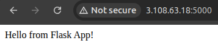
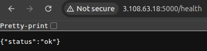
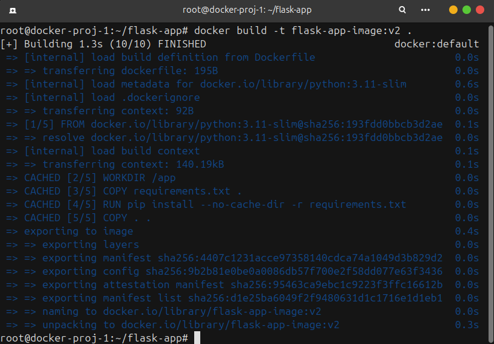
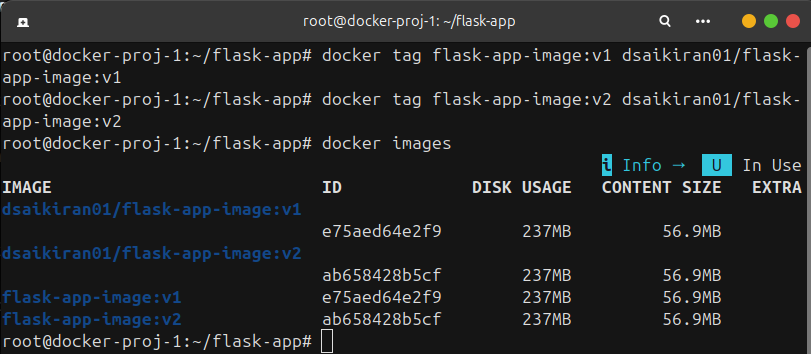
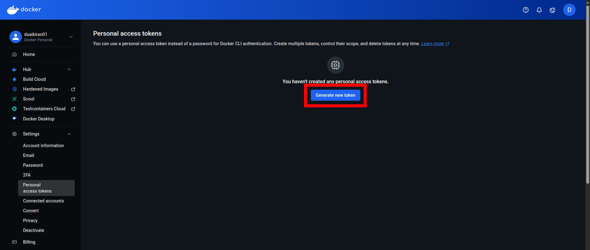
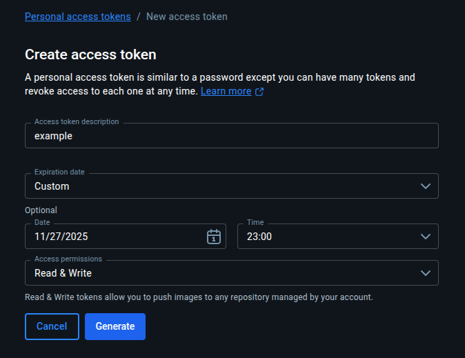
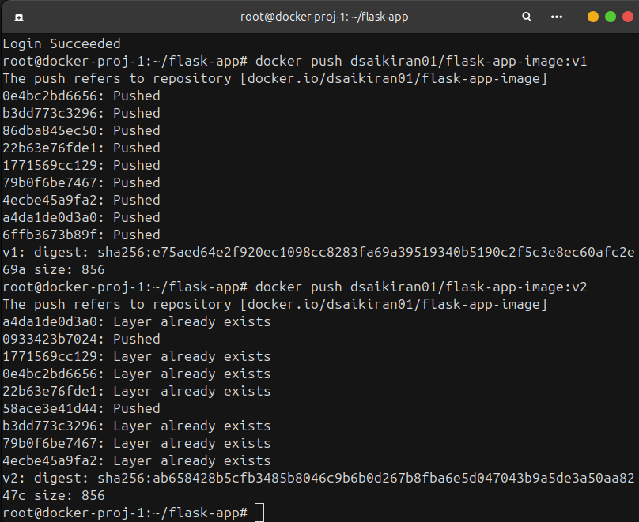
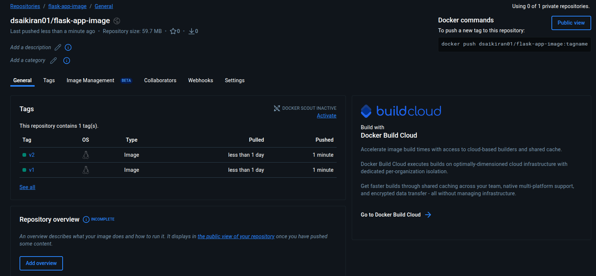

# Project-1: Dockerising Flask Web Application


A simple Flask web application containerised using Docker.
This project demonstrates how a basic web application can be packaged, run, and managed inside a Docker container — similar to real DevOps workflows used in production environments.


## **Project Aim**

* Learn how to containerize a web application using Docker.
* Understand Dockerfile, image building, and container execution.
* Use environment variables and port mapping.
* Push the image to Docker Hub.


## Table of Contents
- [Overview](#overview)
- [Project Code Structure](#project-code-structure)
- [Technologies Used](#technologies-used)
- [Run Locally](#run-locally-without-docker)
- [Docker Setup](#docker-setup)
- [Using Environment Variables](#using-environment-variables)
- [Docker Compose](#docker-compose)
- [Push to Docker Hub](#push-to-docker-hub)
- [Conclusion](#conclusion)


## **Overview**

This project demonstrates

- Dockerfile structure
- Image layers & caching
- Docker commands (build, run, stop, inspect)
- Environment variables in containers
- Port mapping (`-p 5000:5000`)
- Optimizing images using lightweight base image
- Docker Compose
- Pushing image to Docker Hub


## **Project Code Structure**

```
flask-app/
 ├─ app.py
 ├─ requirements.txt
 ├─ Dockerfile
 ├─ .dockerignore
 └─ docker-compose.yml
```


## **Technologies Used**

| Technology     | Purpose                               |
| -------------- | ------------------------------------- |
| Python 3.11    | Programming language                  |
| Flask          | Web framework                         |
| Docker         | Containerization                      |
| Docker Compose | Multi-container management |
| GitHub         | Version control            |
| Docker Hub     | Container image registry              |


## **Run Locally (Without Docker)**

```bash
python3 -m venv env
source env/bin/activate
pip install -r requirements.txt
python3 app.py
```

Visit to check if running:

[http://localhost:5000](http://localhost:5000)



[http://localhost:5000/health](http://localhost:5000/health)




## **Docker Setup**

### 1. Build the Docker image

```bash
docker build -t flask-app-image:v1 .
```



### 2. Run the container

```bash
docker run -d -p 5000:5000 --name flask-app-container flask-app-image:v1
```

### 3. Stop & remove container

```bash
docker stop flask-app-container
docker rm flask-app-container
```


## **Using Environment Variables**

You can change the homepage message using `APP_MESSAGE`:

```bash
docker run -d \
  -p 5000:5000 \
  -e APP_MESSAGE="Hello from inside Docker!" \
  --name flask-app-container-env \
  flask-app-image:v1
```


## **Docker Compose**

`docker-compose.yml`

```yaml
version: "3.9"
services:
  web:
    build: .
    ports:
      - "5000:5000"
    environment:
      - APP_MESSAGE=Hello from Docker Compose!
```

Run it:

```bash
docker compose up -d
```

Stop it:

```bash
docker compose down
```


## **Push to Docker Hub**

### 1. Add Tag
```bash
docker tag flask-app-image:v1 dockerhub-username/flask-app-image:v1
```



### 2. Create personal access token on DockerHub





### 3. Login

```bash
docker login -u username
```

- Give the token when prompted


### 3. Push the Image to DockerHub

```bash
docker push dockerhub-username/flask-app-image:v1
```






## **Conclusion**

This project provided a practical foundation in **Docker-based application containerization**, which is a core skill for DevOps engineers.
By taking a simple Flask application and packaging it into a Docker image, I learned how to:

- Build and optimize Dockerfiles
- Run, stop, and manage containers
- Use environment variables and port mapping
- Automate development setup with Docker Compose
- Use Docker Hub

This hands-on experience reflects **real DevOps workflow**, where applications must be lightweight, portable, reproducible, and ready for deployment — a key part of CI/CD pipelines and cloud-native architecture.
