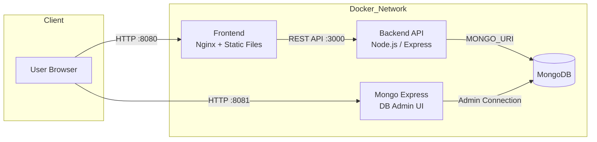
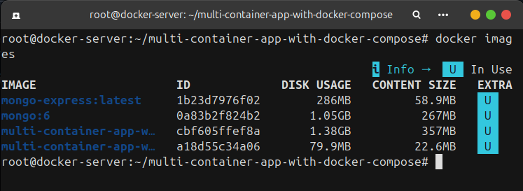
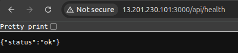
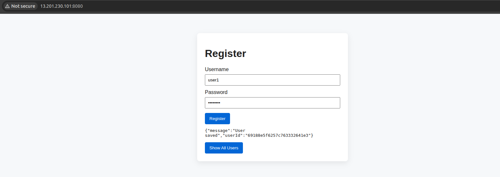
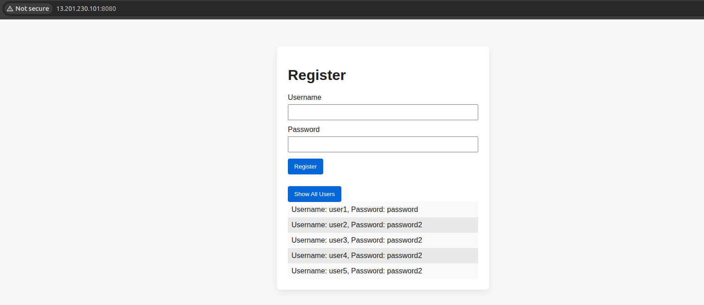
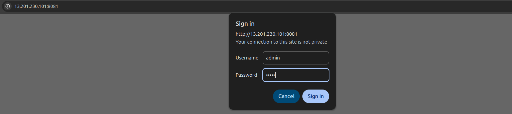
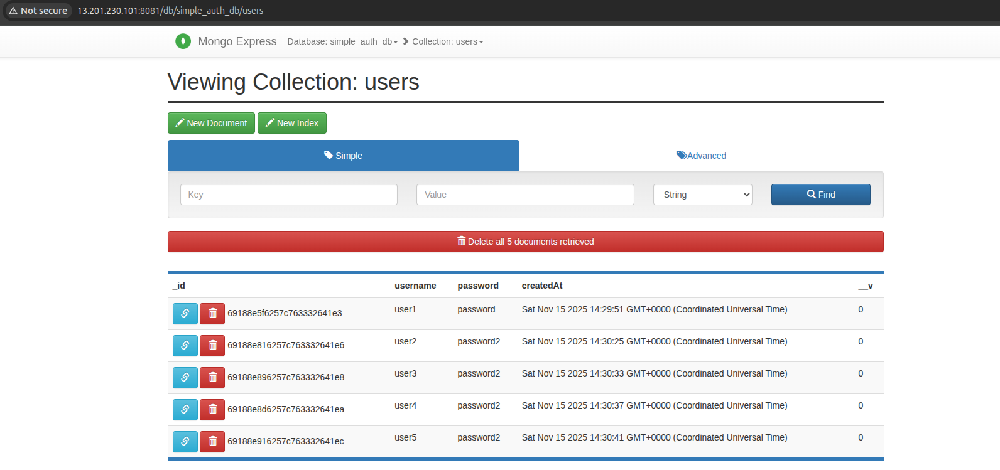

# Project-2: Multi-Container Application using Docker Compose


*Containerising full stack application using Docker — Frontend + Backend + MongoDB + Mongo Express.*


## **Project Aim**

The aim of this project is to build a **production-like multi-container application** using **Docker Compose**, demonstrating how different services can communicate within an isolated containerised environment. The project simulates a real-world microservices setup and focuses on:

* Dockerising multiple services (frontend, backend, database, admin UI)
* Managing them via Docker Compose
* Using environment variables for configuration
* Establishing communication between containers
* Practicing DevOps concepts like containerisation, orchestration, and networking


## Table of Contents
- [Overview](#overview)
- [Architecture](#architecture)
- [Project Code Structure](#project-code-structure)
- [Technologies Used](#technologies-used)
- [Environment Variables](#environment-variables-env)
- [How to Run the Application](#how-to-run-the-application)
- [API Endpoints](#api-endpoints-backend)
- [Stopping and Cleaning](#stopping-and-cleaning)
- [Simulation Output](#simulation-output)
- [Conclusion](#conclusion)


## **Overview**

This project demonstrates how multiple services can work together in isolated containers using **Docker Compose**. It simulates a **real-world microservices environment**, with a frontend, backend API, database, and a database admin dashboard — all fully dockerised and configurable via environment variables.


## **Architecture**




## **Project Code Structure**

```
multi-container-app/
│
├── backend
│   ├── Dockerfile
│   ├── models
│   │   └── User.js
│   ├── package.json
│   ├── package-lock.json
│   └── server.js
│
├── frontend
│   ├── Dockerfile
│   ├── index.html
│   ├── script.js
│   └── styles.css
│
├── .env              # Environment variables
├── docker-compose.yml
└── README.md
```


## **Technologies Used**

| Technology     | Purpose                               |
| -------------- | ------------------------------------- |
| JavaScript     | Programming language                  |
| ExpressJS      | Web framework                         |
| Docker         | Containerisation                      |
| Docker Compose | Multi-container management |
| GitHub         | Version control            |


## **Environment Variables (.env)**

Example `.env` file:

```
MONGO_URI=mongodb://mongo:27017/simple_auth_db
ME_CONFIG_MONGODB_SERVER=mongo
ME_CONFIG_MONGODB_PORT=27017
ME_CONFIG_BASICAUTH_USERNAME=admin
ME_CONFIG_BASICAUTH_PASSWORD=admin
```

Make sure to create `.env` before running the containers.


## **How to Run the Application**

### 1. Clone the Repository

```bash
git clone https://github.com/dsaikiran01/docker-projects.git
cd Project-2-Multi-Container-App-using-Docker-Compose
```

### 2. Start All Containers

```bash
docker compose up --build -d
```

### 3. Access the Application

| Service       | URL                                            |
| ------------- | ---------------------------------------------- |
| Frontend      | [http://localhost:8080](http://localhost:8080) |
| Backend API   | [http://localhost:3000](http://localhost:3000) |
| Mongo Express | [http://localhost:8081](http://localhost:8081) |


## **API Endpoints (Backend)**

| Method | Endpoint        | Description           |
| ------ | --------------- | --------------------- |
| POST   | `/api/register` | Register a new user   |
| GET    | `/api/users`    | Get list of all users |
| GET    | `/api/health`   | Checking backend service |


**Example Request:**

```json
POST /api/register
{
  "username": "john",
  "password": "1234"
}
```


## **Stopping and Cleaning**

Stop all containers:

```bash
docker compose down
```

Cleanup (containers, networks, volumes):

```bash
docker compose down --volumes
```


## **Simulation Output**

1. Created Docker Images after using Docker Compose



2. Backend service checkup



3. Frontend





4. Database






## **Conclusion**

This project provided hands-on experience with **containerisation and orchestration using Docker Compose**, allowing multiple services to interact seamlessly as a real microservice-based application. By implementing environment variables, custom Dockerfiles, networking, and database integration, this project strengthened practical DevOps skills that are essential for deploying modern applications.
