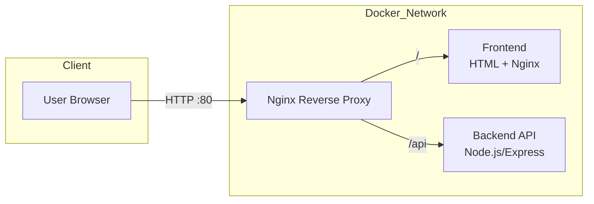
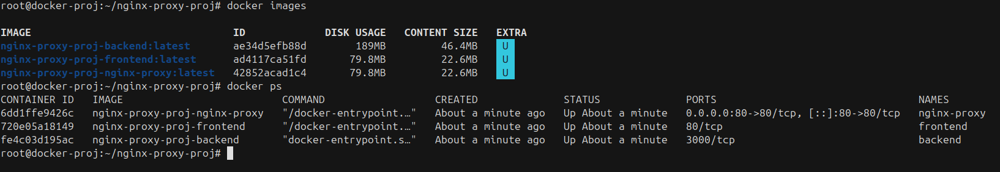
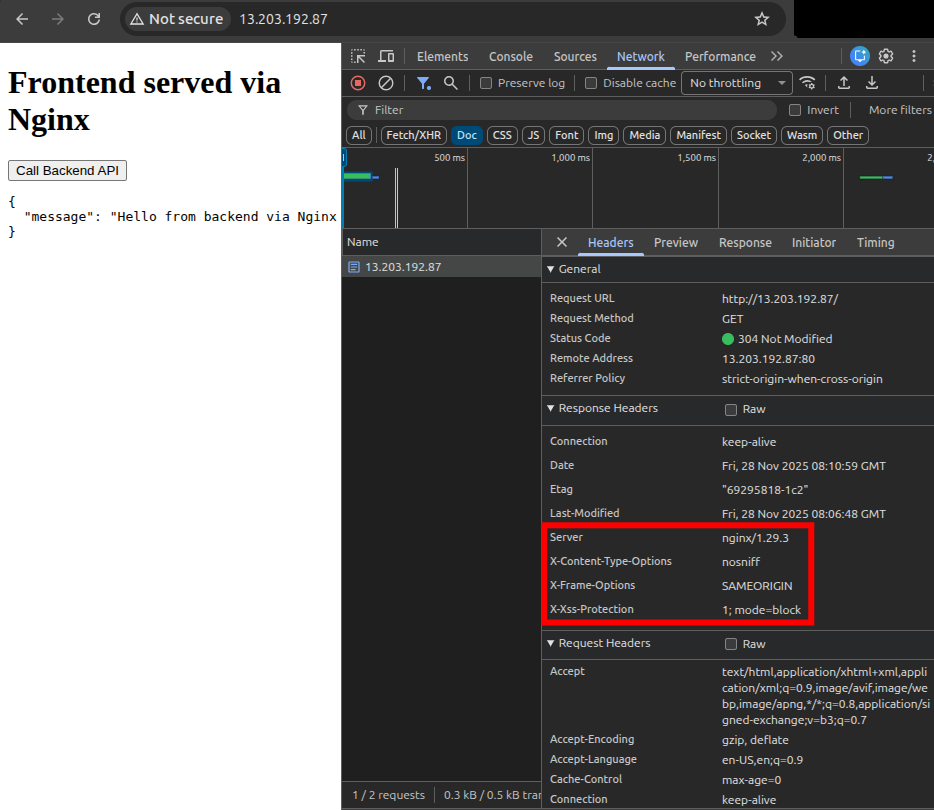
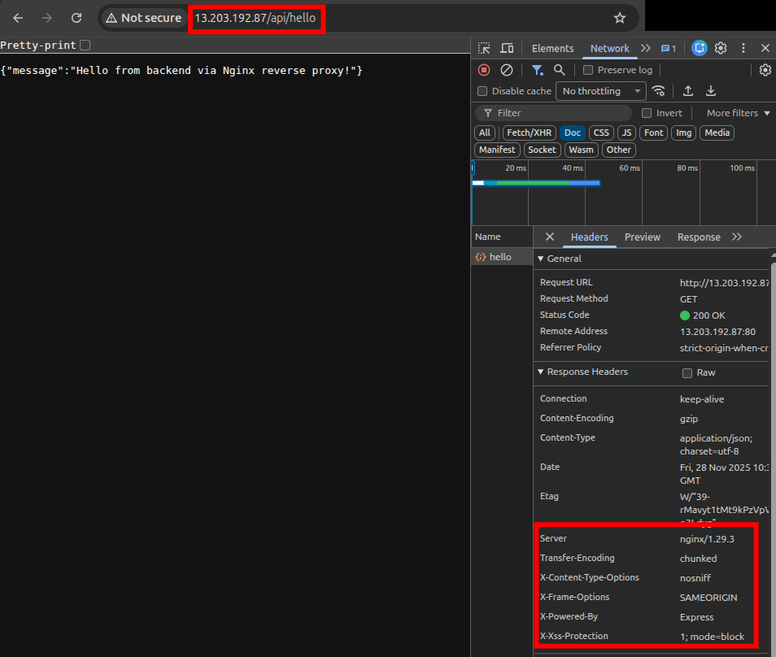
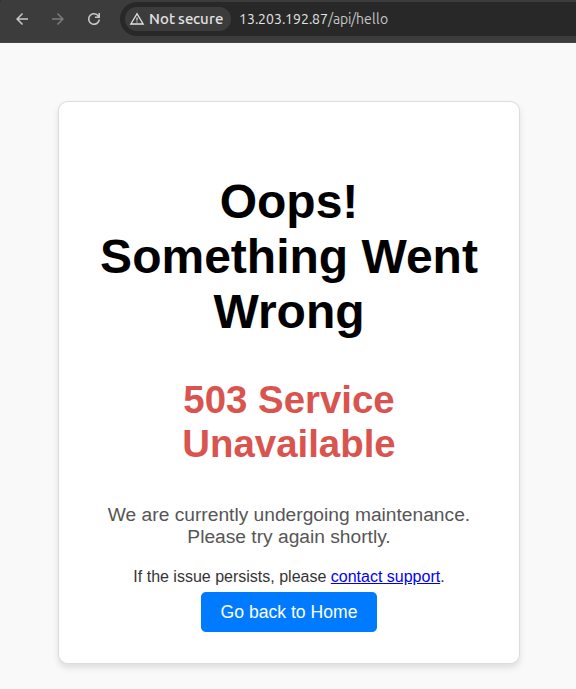
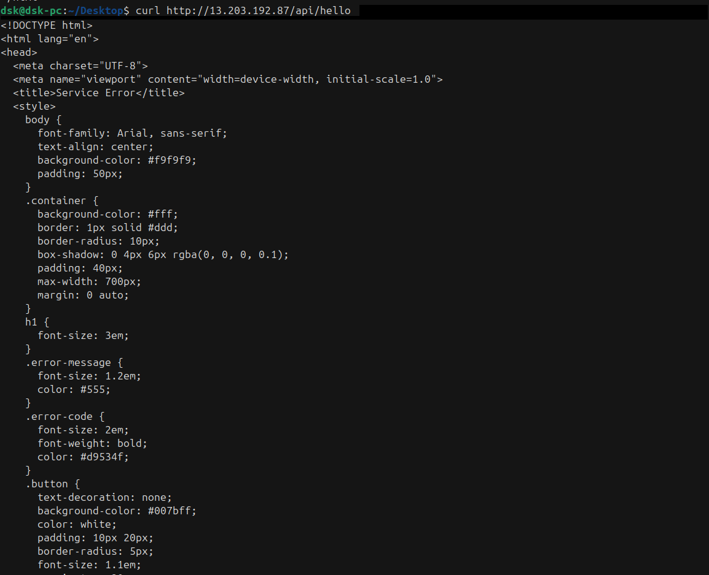

# Project-3: Nginx Reverse Proxy with Docker for Frontend & Backend Routing


A production-style reverse proxy setup using **Nginx**, **Docker**, and **Docker Compose**, where Nginx acts as a **gateway** to route requests to a frontend service and backend API. The project also includes **rate limiting**, **custom error pages**, **security headers**, and **service isolation** using Docker networking.


## **Project Aim**

The aim of this project is to demonstrate how to use **Nginx as a reverse proxy** to handle frontend and backend routing using Docker containers. The setup replicates **real-world deployment patterns**, with support for:

* Reverse proxy routing
* Request rate limiting
* Custom error pages (502, 503, 504)
* Gzip compression
* Security headers
* Multi-container architecture using Docker Compose

This represents a **practical DevOps workflow** used in production applications.


## **Table of Contents**
- [Overview](#overview)
- [Architecture](#architecture)
- [Project Code Structure](#project-code-structure)
- [Technologies Used](#technologies-used)
- [How to Run the Application](#how-to-run-the-application)
- [API Endpoints](#api-endpoints-backend)
- [Stopping and Cleaning](#stopping-and-cleaning)
- [Simulation Output](#simulation-output)
- [Conclusion](#conclusion)


## **Overview**

* Single entry point - Nginx Reverse Proxy
* Routes `/` to frontend service
* Routes `/api` to backend service
* Nginx handles security headers, rate limiting, and custom failure responses
* Each service runs in its own container
* Docker Compose manages multi-container orchestration


## **Architecture**




## **Project Code Structure**

```
nginx-reverse-proxy-project/
│
├── backend/
│   ├── Dockerfile
│   ├── package.json
│   └── app.js
│
├── frontend/
│   ├── Dockerfile
│   └── index.html
│
├── nginx/
│   ├── Dockerfile
│   ├── nginx.conf
│   └── custom_50x.html
│
├── docker-compose.yml
└── README.md
```


## **Technologies Used**

| Category         | Technologies                                        |
| ---------------- | --------------------------------------------------- |
| Reverse Proxy    | Nginx                                               |
| Containerization | Docker, Docker Compose                              |
| Backend API      | Node.js (Express)                                   |
| Frontend         | HTML, CSS, JavaScript                               |
| Networking       | Docker Internal Network                             |
| DevOps Concepts  | Security headers, rate limiting, custom error pages |


## **How to Run the Application**

### 1. Build and Start All Containers

```bash
docker compose up --build -d
```



### 2. Access Services in Browser

| Service     | URL                                                      |
| ----------- | -------------------------------------------------------- |
| Frontend    | [http://localhost/](http://localhost/)                   |
| Backend API | [http://localhost/api/hello](http://localhost/api/hello) |

* **Frontend Response**


* **Backend Response**



## **API Endpoints (Backend)**

| Method | Endpoint     | Description          |
| ------ | ------------ | -------------------- |
| GET    | `/api/hello` | Sample test endpoint |


## **Stopping and Cleaning**

```bash
docker compose down          # Stop containers
docker compose down --volumes --remove-orphans   # Full cleanup
```


## **Simulation Output**

### 1. Test Reverse Proxy

```bash
curl http://localhost/
curl http://localhost/api/hello
```

### 2. Rate Limiting Test

Run this to generate high request load:

```bash
for i in {1..50}; do curl -s http://localhost/api/hello; echo; done
```

Expected output after limit is reached:

`HTTP/1.1 503 Service Temporarily Unavailable...`

### 3. Failure Simulation (Custom Error Page Test)

**Stop backend container**:

```bash
docker stop backend
```

**Then test:**

```bash
curl http://localhost/api/hello
```

Expected: `custom_50x.html` response instead of default Nginx error.

To restart:

```bash
docker start backend
```

* **Error Page**



* **Error Page CLI**




## **Conclusion**

This project demonstrates a realistic reverse proxy setup using Nginx and Docker. Key takeaways include:

* Using Nginx as a gateway for multiple services
* Routing `/` and `/api` to different containers
* Applying Docker Compose for clean orchestration
* Enhancing security using headers
* Implementing **rate limiting** to control API abuse
* Creating **custom error pages** for better user experience

The final result mirrors actual production environments where Nginx is used as an entry point to web applications, enabling scalable, secure, and manageable architecture.
