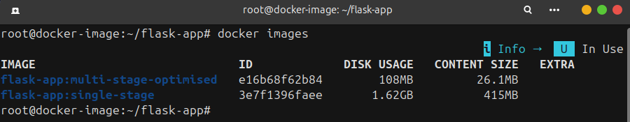
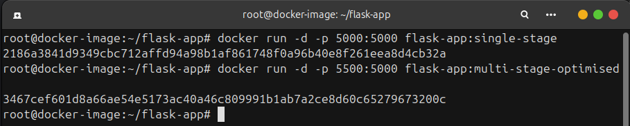
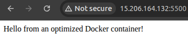

# Project-5: Docker Image Optimisation with Multi-Stage Builds


This project demonstrates Docker image optimisation techniques by containerising the same Flask application using two different approaches:

1. A single-stage Dockerfile
2. A multi-stage optimized Dockerfile

The goal is to understand why optimisation matters, how Docker images grow in size, and how multi-stage builds help create lighter, more secure, and production-ready containers.


## **Project Aim**

- Understand the difference between single-stage and multi-stage Docker builds
- Learn how Docker layers impact image size and performance
- Apply Docker best practices for optimized images
- Reduce image size and attack surface
- Follow production-grade container design patterns


## **Table of Contents**

- [Overview](#overview)
- [Project Code Structure](#project-code-structure)
- [Application Overview](#application-overview)
- [Single-Stage Dockerfile](#single-stage-dockerfile)
- [Multi-Stage Dockerfile](#multi-stage-dockerfile)
- [Comparison: Single vs Multi-Stage](#comparison-single-vs-multi-stage)
- [Best Practices Used](#best-practices-used)
- [Build and Run](#build-and-run)
- [Conclusion](#conclusion)


## **Overview**

This project focuses on Docker image optimisation, a critical skill in real-world DevOps and cloud-native environments.

Key concepts demonstrated:

- Docker image layering
- Build-time vs runtime dependencies
- Image size optimisation
- Security improvements
- Multi-stage builds
- Runtime minimalism

The same Flask application is used in both approaches to ensure a fair comparison.


## **Project Code Structure**

```
flask-app/
├─ app.py
├─ requirements.txt
├─ Dockerfile.single-stage
├─ Dockerfile.multi-stage-optimised
└─ .dockerignore
```


## **Application Overview**

The Flask application exposes a single endpoint:

```
GET /
```

Response:
```
Hello from an optimized Docker container!
````

The application runs on port `5000`.


## **Single-Stage Dockerfile**

### Description

The single-stage Dockerfile represents a beginner-friendly approach where the application and all its dependencies are installed in a single image layer chain.

### Characteristics

- Uses a full Python base image
- Installs dependencies directly in the runtime image
- Includes unnecessary build tools and caches
- Runs as the root user

### Advantages

- Simple and easy to understand
- Minimal Docker knowledge required
- Fast to implement for small demos or learning

### Disadvantages

- Large image size
- Poor layer caching efficiency
- Security risks due to root user
- Build tools remain in the final image
- Not suitable for production environments


## **Multi-Stage Dockerfile**

### Description

The multi-stage Dockerfile separates the build phase from the runtime phase.

- The builder stage installs dependencies and prepares build artifacts
- The runtime stage contains only what is required to run the application

This results in a smaller, cleaner, and more secure image.


### Build Stage (Builder Image)

- Uses a lightweight `python:3.11-slim` image
- Installs build tools only when required
- Builds Python dependency wheels
- Cleans up package manager caches

This stage acts as a temporary factory and is discarded after the build.


### Runtime Stage

- Uses a minimal `python:3.11-alpine` image
- Copies only the built artifacts from the builder stage
- Does not contain compilers or build tools
- Runs the application as a non-root user


## **Comparison: Single vs Multi-Stage**

| Feature | Single-Stage | Multi-Stage |
|------|-------------|-------------|
| Image Size | 1.62 GB | 108 MB |
| Size Reduction | No | 93.48% |
| Build Tools in Final Image | Yes | No |
| Security | Weak (root user) | Improved (non-root user) |
| Layer Caching | Inefficient | Optimized |
| Production Ready | No | Yes |
| Maintenance | Harder | Easier |
| Attack Surface | Large | Minimal |


## **Best Practices Used**

The multi-stage Dockerfile follows several industry-standard best practices:

### 1. Multi-Stage Builds
Separates build-time and runtime dependencies, keeping the final image minimal.

### 2. Minimal Base Images
- `python:3.11-slim` for building
- `python:3.11-alpine` for runtime

Reduces image size and startup time.

### 3. Optimized Layer Caching
- `requirements.txt` copied before application code
- Dependency layers rebuilt only when dependencies change

### 4. Fewer Layers
- Commands combined using `&&`
- Reduces image complexity and size

### 5. Cache Cleanup
- Removes `apt` and `pip` caches
- Prevents unnecessary files from inflating the image

### 6. Non-Root User
- Application runs as an unprivileged user
- Improves container security and isolation

### 7. Minimal Runtime Footprint
The final image contains:
- Python runtime
- Application dependencies
- Application source code

Nothing else.


## **Build and Run**

### Build Images

```bash
docker build -f Dockerfile.single-stage -t flask-app:single-stage .
docker build -f Dockerfile.multi-stage-optimised -t flask-app:multi-stage-optimised .
````

### View Build Images

```bash
docker images
```



Image size is reduced from 1.62 GB (1658.88 MB) to 108 MB → 93.48% reduction in image size


### Run Containers

```bash
docker run -d -p 5000:5000 flask-app:single-stage
docker run -d -p 5500:5000 flask-app:multi-stage-optimised
```



Access in browser:

* Single-stage: `http://localhost:5000`
* Multi-stage: `http://localhost:5500`





## **Conclusion**

A key outcome of this project was a 93.48% reduction in Docker image size, achieved by applying multi-stage builds and container optimisation best practices. This demonstrates how proper Docker design directly impacts:

* Application delivery speed
* Infrastructure efficiency
* Operational costs
* Production reliability

This project highlights why Docker image optimisation is essential in modern DevOps workflows. By comparing a single-stage Dockerfile with a multi-stage build, I learned how to:

* Reduce Docker image size dramatically
* Improve container security
* Apply best practices used in production systems
* Build efficient, maintainable container images

Multi-stage builds are now considered a standard approach for containerising applications and are widely used in CI/CD pipelines and cloud platforms. 

This project reflects real-world DevOps engineering practices, where optimized container images are essential for scalable, cloud-native systems.
